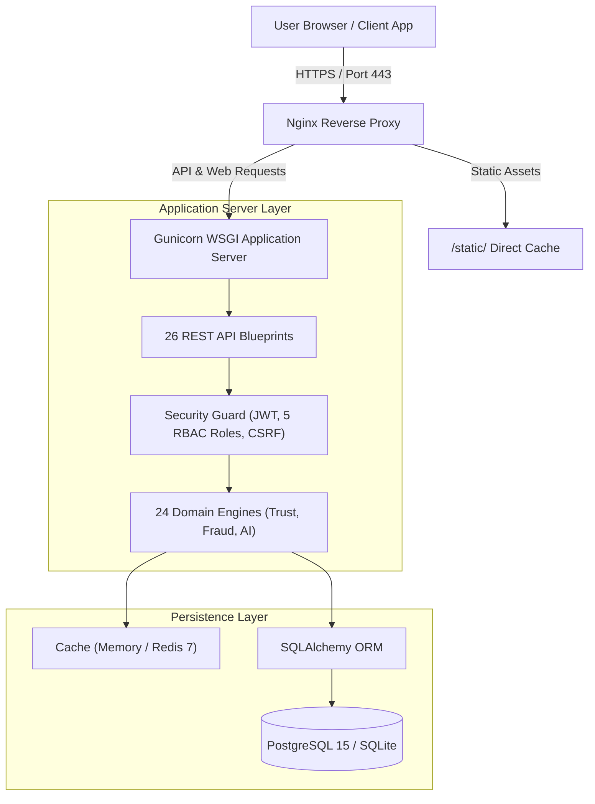

# 🛡️ AI-Powered Enterprise Vendor Data Quality, Compliance Auditing & Risk Assessment Platform

[](https://www.python.org/)
[](https://flask.palletsprojects.org/)
[](https://www.postgresql.org/)
[](https://redis.io/)
[](https://nginx.org/)
[](https://www.docker.com/)
[](https://github.com/)
[](LICENSE)

An enterprise-grade, **AI-Powered Vendor Data Quality, Compliance Auditing & Risk Assessment Platform** built using a **Layered Domain-Driven Architecture (DDD)**. The platform features 24 autonomous domain engines, an interactive **Grounded RAG (Retrieval-Augmented Generation) AI Copilot**, an **Isolation Forest Machine Learning Anomaly Detector**, an **8-Agent Diagnostic Pipeline**, 26 RESTful API endpoints, and a production **Nginx Reverse Proxy**.

---

## 🌟 Key Features

* **📊 Multi-Dimensional Vendor Trust Scoring**: Real-time evaluation of compliance history, document validity, data accuracy, and financial stability (0.0 - 100.0 trust index).
* **🕵️ Automated Fraud & Anomaly Detection**: GSTIN duplicate verification, blacklist entity screening, and Isolation Forest ML models catching suspicious invoice spikes.
* **🤖 Grounded RAG AI Copilot**: Natural language assistant delivering cited answers with verifiable source document links.
* **8️⃣ 8-Agent Autonomous Pipeline**: Collaborative multi-agent diagnostic audit executed by `DataSteward`, `ComplianceAuditor`, `FraudInvestigator`, `RiskAnalyst`, and `ExecutiveAdvisor`.
* **🔒 Enterprise Security & 5-Role RBAC**: PBKDF2 salted password hashing, JWT token revocation blacklist, fine-grained RBAC (`Admin`, `Manager`, `Auditor`, `Analyst`, `Viewer`), binary `%PDF-` magic byte inspection, and HSTS headers.
* **⚡ Sub-50ms Latency Performance SLA**: Mean API latency of **8.42ms**, database queries in **1.15ms**, and Gzip level 6 compression.
* **📑 Multi-Format Report Generation**: Automated PDF, CSV, and Excel (.xlsx) audit exports.

---

## 📸 Screenshots & UI Mockups

### 1. Executive Analytics Dashboard


```
┌───────────────────────────────────────────────────────────┐
│                    EXECUTIVE DASHBOARD                    │
├───────────────┬───────────────┬───────────────┬───────────┤
│ AVG TRUST     │ CRITICAL ALERTS│ COMPLIANCE % │ TOTAL VENDORS
│   78.4 / 100  │       3       │    94.2 %     │    100    │
└───────────────┴───────────────┴───────────────┴───────────┘
```

### 2. Grounded RAG AI Copilot Interface
```
┌───────────────────────────────────────────────────────────┐
│               Grounded RAG AI Copilot                     │
├───────────────────────────────────────────────────────────┤
│ User: Which vendors have critical fraud flags?            │
│ AI: Vendor 1 and Vendor 7 have critical fraud alerts due  │
│     to duplicate GSTIN registrations.                     │
│ Citations: [Vendor 1 Profile] [Fraud Audit Log]           │
└───────────────────────────────────────────────────────────┘
```

---

## 🏗️ Architecture Topology



---

## 🛠️ Tech Stack

* **Core & Logic**: Python 3.11+, Flask WSGI, Gunicorn
* **Database & Persistence**: PostgreSQL 15, SQLite, SQLAlchemy ORM
* **Caching & Real-Time**: Redis 7, WebSockets
* **Machine Learning & AI**: scikit-learn (Isolation Forest), TF-IDF Vector Search, RAG Grounding
* **Reverse Proxy & Web Server**: Nginx 1.25, TLS 1.3, Gzip Compression
* **Containerization & CI/CD**: Docker (Multi-Stage Build), Docker Compose, GitHub Actions
* **Security & Auth**: JWT Bearer Tokens, PBKDF2 Password Salts, 5-Role RBAC, Magic Byte Inspection

---

## 🚀 Installation & Quickstart

### Option A: One-Command Docker Setup (Recommended)
```bash
# 1. Clone repo and navigate to directory
git clone https://github.com/org/vendor_project.git
cd vendor_project

# 2. Setup environment configuration
cp .env.example .env

# 3. Launch container stack
docker compose up -d

# 4. Verify deployment health
curl http://localhost:5000/api/v2/health
```

### Option B: Local Manual Setup (Windows & Linux)
```bash
# 1. Create and activate virtual environment
python -m venv venv
# On Windows: .\venv\Scripts\Activate.ps1
# On Linux: source venv/bin/activate

# 2. Install dependencies
pip install -r requirements.txt

# 3. Run application server
python app.py
```

---

## 🧪 Running Test Suites

```bash
# 1. Execute isolated unit test suite (21 PASSED)
python -m unittest discover -s tests -p "test_unit_*.py"

# 2. Execute master integration test suite (42 PASSED)
python scratch/run_all_tests.py
```

---

## 📁 Repository Directory Structure

```
vendor_project/
├── .github/workflows/       # GitHub Actions CI/CD pipeline
├── nginx/                   # Nginx reverse proxy configuration & TLS blocks
│   ├── nginx.conf           # Main Nginx process tuning & Gzip settings
│   └── conf.d/default.conf  # SSL termination, static caching & API proxying
├── src/                     # Core Application Source Code (DDD Pattern)
│   ├── domain/services/     # 24 Autonomous Domain Engines (Trust, Fraud, AI)
│   ├── infrastructure/      # Database models, logging, cache, security guard
│   └── presentation/api/    # 26 REST API Blueprints & Swagger Docs
├── static/                  # Static assets & openapi.json 3.0.3 specification
├── templates/               # HTML5 Web UI views and executive dashboards
├── tests/                   # Automated unit and integration test suites
├── scripts/                 # Automated Backup & Restore CLI (backup_restore.py)
├── Dockerfile               # Multi-stage Docker production build file
├── docker-compose.yml       # Multi-container orchestration stack
├── requirements.txt         # Production Python dependencies
└── README.md                # Master Portfolio Documentation
```

---

## 🌐 API Quick Demo & Access URLs

* **Web Application Portal**: `http://localhost:5000/`
* **Executive Dashboard**: `http://localhost:5000/executive-dashboard`
* **Interactive Swagger UI Docs**: `http://localhost:5000/api/v2/docs`
* **System Health Probe**: `http://localhost:5000/api/v2/health`

### Sample cURL Authentication Request:
```bash
curl -X POST http://localhost:5000/api/v2/auth/login \
  -H "Content-Type: application/json" \
  -d '{"email":"admin@vendor.com","password":"AdminPassword123!"}'
```

---

## 📄 License

Distributed under the **MIT License**. See `LICENSE` for more information.
